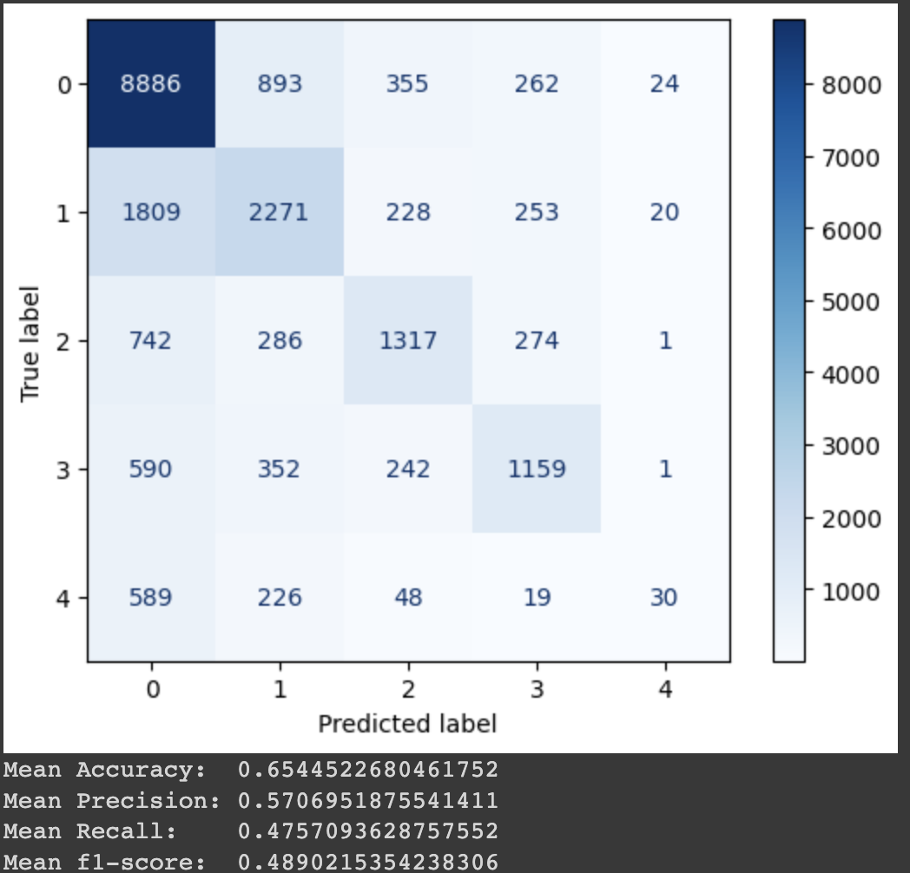
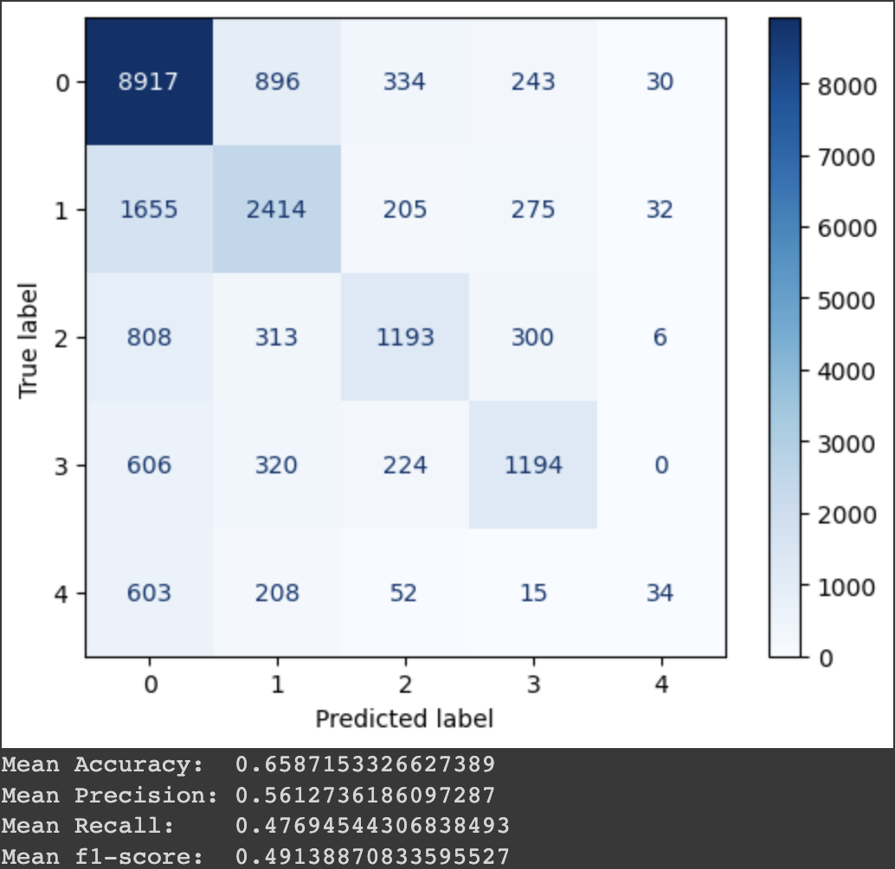
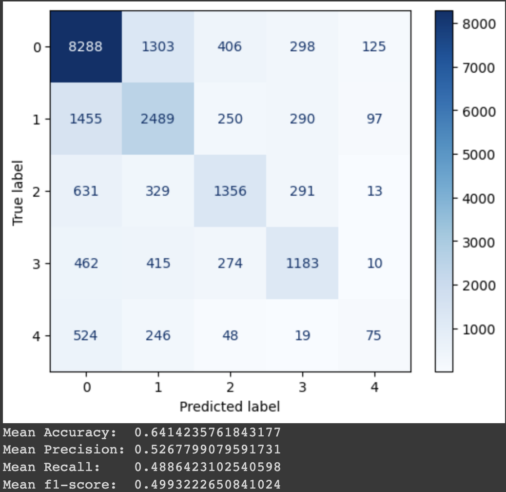
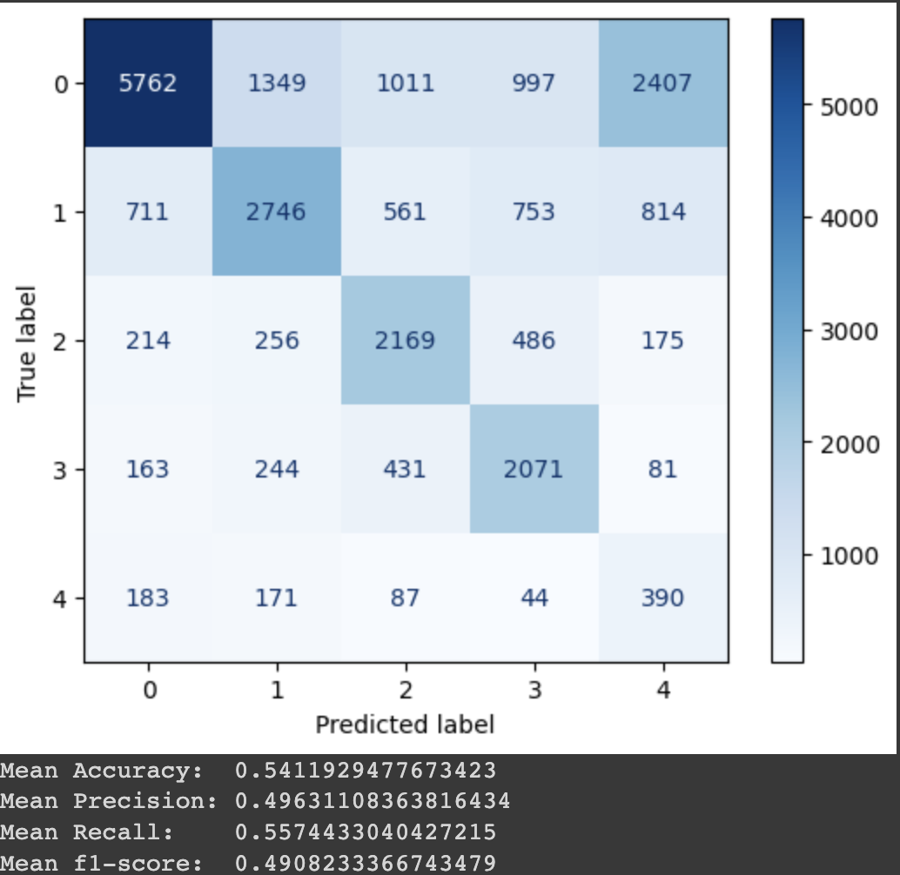

# Stack Overflow Post Moderation Using Deep NLP
Author:  
Alexander Claudino Daffara  
https://medium.com/@alexanderdaffara  
https://www.linkedin.com/in/alexanderdaffara/  

Welcome to my repo, where I combine data analysis with advanced machine learning algorithms to optimize the task of automating Stack Overflow's post Moderation.  

## Business Problem
Stack Overflow is a the Go-to programer's Q&A platform with the business goal creating a one-stop-shop for programming questions. Say you have a programming question, you can either browse the plethora of previous asked questions or make your own post. Anyone with domain experience can answer and discuss that post to recieve reputation points. Finally, all the relevant collaborative information related to that inquiry will be on that post for anyone to come.  

Unfortunately, not every question will be consistent with the platform goals and must be moderated.  

> High Quality Answers -> *Require* -> High Quality Questions -> *Require* -> High Quality Moderation

Currently, Stack Overflow outsources the moderation to members with high enough reputation points, who can vote on whether a new post should be left open for answers and discussion or should be closed for a specific reason. This can be detrimental to the users who need quick answers to their programming questions and must wait for their new post to be manually reviewed. It also relies on trusting these high reputation members to make business decisions for the platform.  

Hence, we'll employ a machine learning model to automate this process using data provided from the kaggle competition: https://www.kaggle.com/c/predict-closed-questions-on-stack-overflow .  

## Goal
 - Iterate models and Natural Language Processing techniques to accuratly classify the reason a new post will be closed

## Data Understanding
Stack Overflow's 2012 Data-Dump (21.47 GB):  

Containing 140k examples of posts, their details and their moderation results.  

The target variable "OpenStatus" has the following categories:
 - open: The post is in alignment with the platform's goals
 - not a real question: the post is ambiguous or vague, making it hard to tell what is being asked
 - off topic: the post is more suited to one of Stack Overflow's other websites in their stack exchange network, or is not a programming related questions
 - not constructive: the post is inducing debate or argumentation instead of being a constructive answer to a programming question
 - too localized: the post asks a question too specific to a country or region or softare version which will not be relevant in the near future

The provided information about the post includes:
 - The ownwer's reputation
 - age of the owner's account
 - Title of the post
 - Body Markdown of the post
 - Specified Tags related to the post (for searching)

## Data Gathering and EDA
#### Post Owner:  
The post owner's reputation and account age at the time of making the post can heavily influence how familiar they would be with with a valid post looks like. This data was heavily skewed as it seems most people who ask questions are new to the platform (Assumedly most who aren't new are answering those questions). I chosen to apply a power transformation to these features to normalize their values for inferece.  

#### Post Content:  
I explored two types of embeddings for the text content of the post: TF-IDF and using a PreTrained RoBERTa model from huggingface. 

I also attempted to extract as many features as possible from analysing the text:  
 - Number of tags pinned to the post
 - Number of Code blocks used in the question. As a question without code may be harder to interpret and invoke moderation.
 - Number of blockquotes, and html tag which is commonly used to display an error message from code
 - Number of sentences
 - Length of the title
 - Number of sentences starting with "I"
 - Number of sentences starting with "you", which can be more indicative of a 'not constructive' post
 - Number of interrogative words like "who", "what", "when", ...

## Baseline Model - Logistic Regression with Tf-Idf Embeddings

## Model Iteration 2 - Histogram XGBoost Classifier with Tf-Idf Embeddings

  

## Model Iteration 3 - Sequential Deep Neural Network with Tf-Idf Embeddings

  

## Model Iteration 4 - Histogram XGBoost Classifier with RoBERTA Embeddings

  

## Model Iteration 5 - Sequential Deep Neural Network with RoBERTA Embeddings

  

## Conclusions  
Unfortunately the models did not perform fantastically, with the best models performing at around 65% classification accuracy.  

Although with these results I would recommend using the model with the best weighted average f1-score to prioritize which new posts should recieve moderation attention. Those with the highest probability to be closed, as predicted by the model should be moderated first.  

Hence our Final Model would be the Histogram XGBoost with RoBERTa embeddings, performing with a whopping 64% weighted average f1-score, which is far better than randomly guessing.

## Future Improvements  
In the future I would like to attempt extracting more meaning from the text, using different kinds of pretrained text embeddings and extracting more features from the text.  
  
I would also like to try training with the full 3.4M post dataset, having more time to preprocess all that data.

Kaggle Competition Link:
https://www.kaggle.com/c/predict-closed-questions-on-stack-overflow